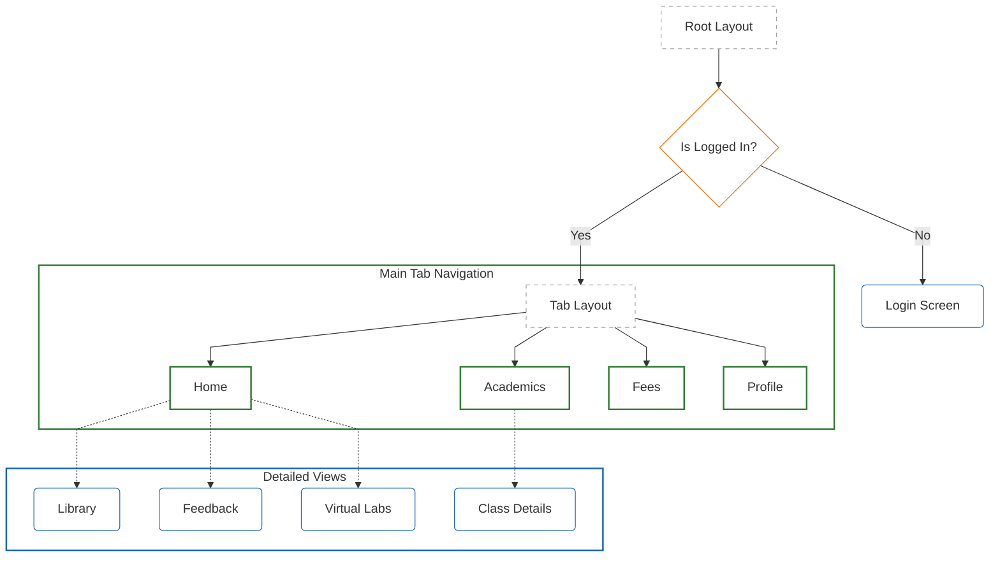
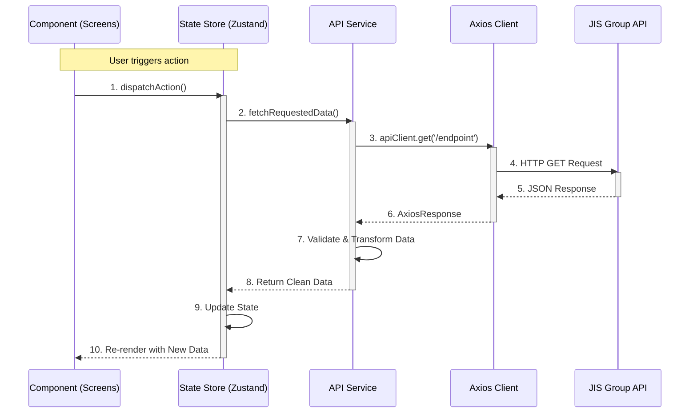

# JIS Companion (Unofficial)

Unofficial version of the JIS Companion app built with React Native and Expo.

## Installation

```bash
# Install dependencies
npm install

# Start development server
npx expo start
```

## Application Structure



## Data Flow Architecture

This diagram illustrates how the application fetches and processes data from the JIS Group API.



## Requirements

- Node.js
- Expo CLI
- iOS Simulator or Android Emulator (for mobile development)

## Disclaimer

This is an unofficial app and is not affiliated with or endorsed by JIS.

## License

MIT
